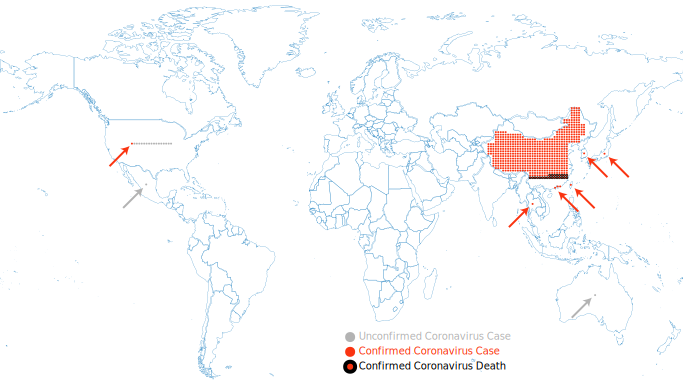

As of this writing, China is battling a [fierce outbreak of a new
coronavirus], which is also threatening to spread to other parts of the
world.

It's scary.

And that means it is also very important to keep things in perspective.
Panicking and overreacting will make things worse for everyone, including
yourself.

Which brings me to this map showing the spread of the 2019-nCoV coronavirus.

This and several more like it have been featured in [articles from _The
Sun_]. These graphics paint a dire portrait of 2019-nCoV are very
exaggerated. The data are about a week old as of this writing, but the
representation of the data makes the spread look far worse than it actually
is.

The main problem with this map is that there is no relative proportion to
the number of infected cases. Whether there is one case or hundreds, the
entire containing country is colored the same deep red (with the exception
of Australia for no apparent reason). The amount of red is proportional to
the landmass of the country, not the danger in the region (a common problem
for [this type of visualization]). And since the United States and Mexico
alone have a larger area than China, it makes the spread look hundreds of
times worse than it is.

To make matters worse, the map uses a strong black label to report the
number of deaths in China and then uses the same type of black label to
report unconfirmed cases in the US. Being dead and being under observation
are about as different can be, but it is another trick to make the spread
look worse than it is.

And just to ratchet up the fear another notch, the map has random pictures
of people in medical masks.

Although 2019-nCoV is currently mostly contained in China, this map makes
it look like it's well on its way to infecting the entire world. Paired
with sensational headlines like _[BUG UNLEASHED Coronavirus spread may be
unstoppable as Chinese New Year sparks THREE BILLION trips and
‘super-spreaders’ fuel crisis]_ and _[PANDEMIC THREAT Coronavirus ‘could’ve
infected 10,000 already’ amid warning it’s ‘as deadly as Spanish flu – that
killed 50 million’]_ and _[WORLD WAR FLU Deadly coronavirus could have
ALREADY spread to UK after killing 17 and infecting 10,000 in China
alone]_, _The Sun_ is intentionally spreading fear in the interest of
selling more papers.

Before we close, let's take a better look at the same data. Here is my
attempt to more accurately represent the same data.

We see that when the 2019-nCoV cases are shown proportionally, we see that
the cases in the rest of the world are pales in comparison with China.

As a final word, the 2019-nCoV coronavirus is indeed a big deal. It is a
dangerous infectious disease responsible for many deaths. But so far the
evidence points to 2019-nCoV not being a civilization ending threat.
Fortunately, [2019-nCoV appears to have a lower mortality rate than the
recent SARS and MERS outbreaks].

For now, the [best advice] is standard prevention.

1. Keep good hygiene. Wash your hands often. Avoid touching your face.
2. Avoid close contact with sick people.
3. If you get sick, stay home. Cover your mouth when coughing or sneezing.
   Contact your healthcare provider if you think you have contracted
   something serious.

[fierce outbreak of a new coronavirus]: https://www.cnn.com/2020/01/28/asia/wuhan-coronavirus-update-intl-hnk/index.html
[articles from _The Sun_]: https://www.thesun.co.uk/news/10799738/coronavirus-could-already-spread-uk/
[this type of visualization]: https://en.wikipedia.org/wiki/Choropleth_map
[BUG UNLEASHED Coronavirus spread may be unstoppable as Chinese New Year sparks THREE BILLION trips and ‘super-spreaders’ fuel crisis]: https://www.the-sun.com/news/290423/coronavirus-spread-may-be-unstoppable-as-chinese-new-year-sparks-three-billion-trips-and-super-spreaders-fuel-crisis
[PANDEMIC THREAT Coronavirus ‘could’ve infected 10,000 already’ amid warning it’s ‘as deadly as Spanish flu – that killed 50 million’]: https://www.thesun.co.uk/news/10794530/coronavirus-as-deadly-spanish-flu-killed-millions/
[WORLD WAR FLU Deadly coronavirus could have ALREADY spread to UK after killing 17 and infecting 10,000 in China alone]: https://www.thesun.co.uk/news/10799738/coronavirus-could-already-spread-uk/
[2019-nCoV appears to have a lower mortality rate than the recent SARS and MERS outbreaks]: https://www.sciencealert.com/how-worried-should-we-be-about-the-wuhan-coronavirus-outbreak
[best advice]: https://www.cdc.gov/coronavirus/2019-ncov/about/prevention-treatment.html

> **Update: December 1, 2025**
>
> Well, this post aged like milk. Although I stand by most of what I said in
> this post, my condescending attitude was, in retrospect, inappropriate for the
> seriousness of what the disease now known as COVID-19 became.
>
> In looking back at my "more accurate" depiction of COVID-19 cases, I see an
> issue is that although I correctly proportioned the number of cases, what I
> failed to take into account that not all cases have the same significance. The
> difference between the 499th and 500th case is within statistical error, but
> the difference between 0 cases and 1 cases is a _big deal_. The first case
> signals a spread of the disease across boarders and a serious step toward a
> pandemic. Representing case 1 as just another case was a mistake on my part.
> At the very least, there should be a visual indication highlighting where any
> cases have been established. Perhaps something like this.
>
> 
>
> I don't claim this to be perfect, but I think it gets the point across better.
